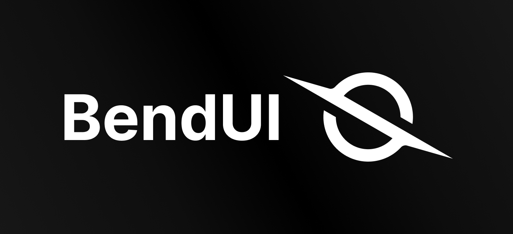

<p align="center">
  
</p>

>### Bend.UI is a free and open-source component library for **Vue 3**, built with **TypeScript** and **Tailwind CSS**. <br /> Each component is crafted to feel intuitive, adaptable, and subtly magnetic — guiding users effortlessly through your interface.

---

## Installation
```sh
# with Yarn
$ yarn add @

# with npm
$ npm i @c

# with pnpm
$ pnpm add @

# with Bun
$ bun add @
```

## Contributing

Please read the [Contributing Guide](/CONTRIBUTING.md).

## License

Licensed under the [MIT license](/LICENSE.md).

<br /> 

>⚡ Powered by: Vue 3 + TypeScript + Tailwind CSS  .
